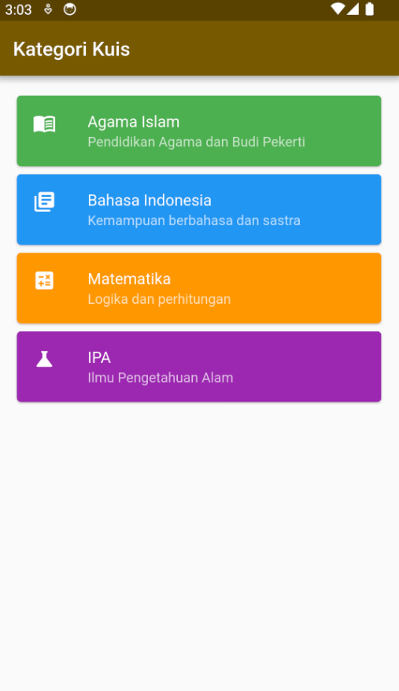
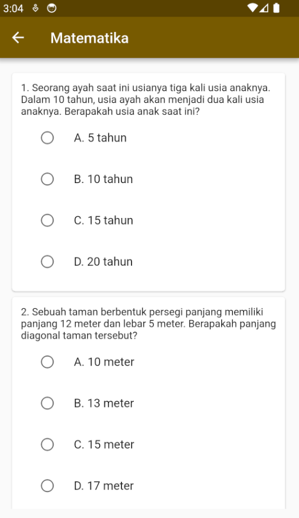
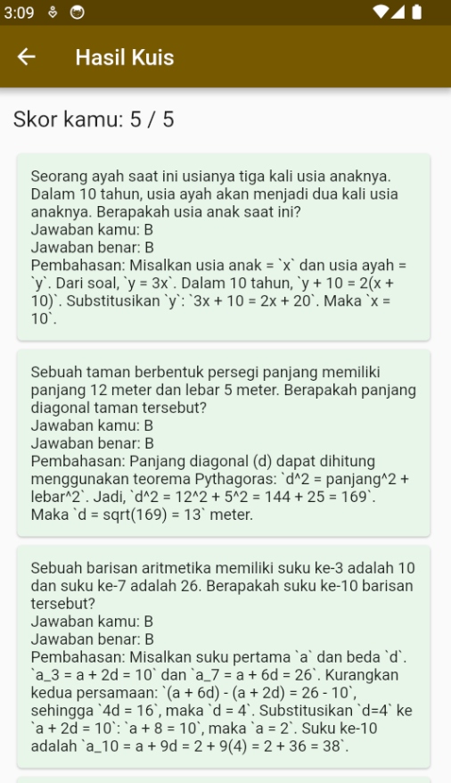

# Gemini Online Quiz App (Flutter)

Aplikasi **Kuis Online berbasis Flutter** yang memanfaatkan **Gemini AI** untuk menghasilkan soal secara dinamis berdasarkan **kategori** dan **tingkat kesulitan** (Easy, Medium, Hard).
Aplikasi ini dibuat sebagai bagian dari pembelajaran **Pemrograman Bergerak (Flutter)** dan eksplorasi integrasi **AI Generatif** dalam aplikasi mobile.

---

## Fitur Utama

- Pilihan kategori kuis
- Level soal: Easy, Medium, Hard
- Soal dibuat otomatis oleh **Gemini AI**
- Pilihan ganda (A–D)
- Perhitungan skor otomatis
- Pembahasan jawaban (benar & salah)

---

## Tampilan Aplikasi

> Berikut adalah beberapa tampilan utama aplikasi:

### Halaman Kategori


### Pilih Level & Mulai Kuis


### Halaman Soal Kuis


### Hasil & Pembahasan


---

## Struktur Project
lib/
│
├── model/
│ └── model_question.dart
│
├── services/
│ └── quiz_service.dart
│
├── page/
│ ├── category_page.dart
│ ├── quiz_page.dart
│ └── result_page.dart
│
└── main.dart

## Konfigurasi Gemini API Key

Aplikasi ini **TIDAK menyertakan Gemini API key di dalam repository** demi keamanan.

### Cara Mengisi API Key

Buka file berikut: lib/page/quiz_page.dart
Temukan kode:

```dart
QuizService(apiKey: 'GEMINI_API_KEY');
